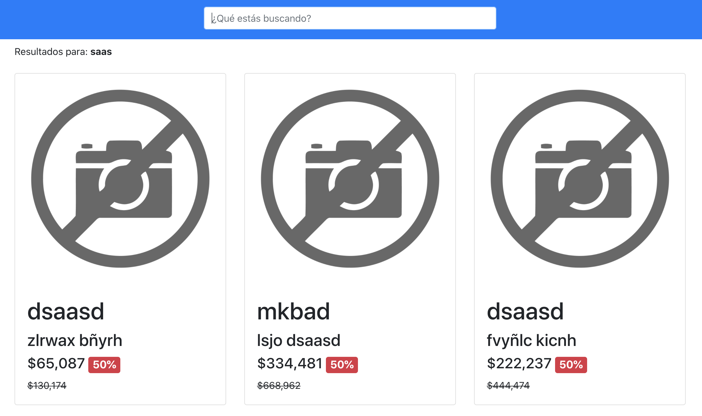

# Walmart-Test
This is a solution to the challenge of searching for products using palindromes for Walmart.

## Features

- Express
- MongoDB
- Jest
- Docker
- ReactJS

## Requirements

- [node & npm](https://nodejs.org/en/)
- [git](https://git-scm.com/)
- [docker](https://www.docker.com/)
- populate mongoDB with [sample data](https://github.com/walmartdigital/products-db)

## Installation

- `git clone https://github.com/francijpg/walmart-test.git`
- `cd walmart-test`
- docker-compose build
- docker-compose up

## Test
- `cd walmart-test/backend`
- npm run test

## Screenshot App
